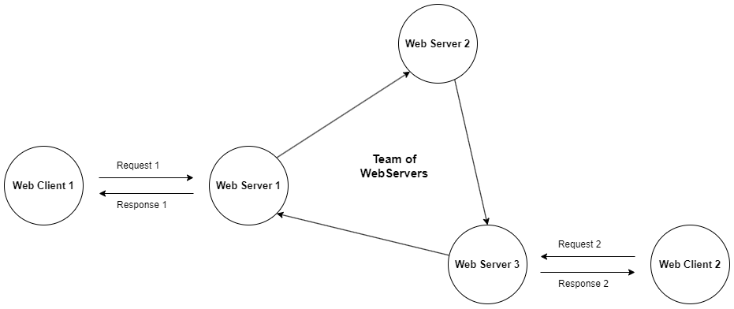

# Co-op WebServers



## About

Τhis project was created for the purposes of a university course. It represents an abstract creation of a circular list of web servers that communicate with each other and respond/forward client requests.

It uses local IPv4 andress ``127.0.1.1`` and all the IP:PORT comparisons/storage inside the program are based on the different port numbers.

``JSON`` format-protocol is used for all the data communations between the servers and server-client.

## Setup

- **Linux Ubuntu**

    ```bash
    sudo apt install python3
    sudo apt install python3-pip
    pip install -r requirements.txt
    ```

## Usage

- **WebServer**

    ```bash
    usage: WebServer.py [-h] [-i IP] [-p PORT] [-v]

    options:
    -h/--help       show this help message and exit
    -i/--ip         Previous (in list) IP address
    -p/--port       Previous (in list) port number
    -v/--verbose    (For showing the 'check' messages between the servers)
    ```

- **WebClient**

    ```bash
    usage: WebClient.py [-h] [-get GETFILE] [-put PUTFILE] [-i IP] [-p PORT]

    options:
    -h/--help       show this help message and exit
    -get/--GETFILE  GET Request: file name
    -put/--PUTFILE  PUT Request: file
    -i/--ip         Server's listening IP address
    -p/--port       Server's listening PORT number
    ```

### Servers communication

- Run the first server (*WebServer 1*) on a new terminal (process):

    ```bash
    python3 src/WebServer.py
    ```

- Run a second server (*WebServer 2*) on a new terminal (process) by appending to the previous one using the following syntax:

    ```bash
    python3 src/WebServer.py -i 127.0.1.1 -p <PORT>
    ```

  - After the insertion, in this example the **[127.0.1.1:<PORT_1>]** server updates it's own list of connected servers and then a **CHECK** message is send to the next server in the list by checking connectivity (in this example the next server is the new one: **[127.0.1.1:<PORT_2>]**). The new one will catch the **CHECK** message and forward it to the next one in the list. The cicrular message will stop after reached the *"creator"* server, the one that originally sent the **CHECK** message. If any server does not respond to the CHECK message then it will be deleted from the list maintained by the previous server and the circular message will continue to the next (from the one that has been deleted) available active server.

### Clients requests

- If any client request cannot processed by a server it is forwarded to the next one in the list by starting a circular **FORWARD** message updating the requested item in each server's database.

- **PUT** request:
  
    ```bash
    python3 src/WebClient.py -put test_files/index.html -i 127.0.1.1 -p <PORT>
    ```

- **GET** request:
  
    ```bash
    python3 src/WebClient.py -get index.html -i 127.0.1.1 -p <PORT>
    ```

## Useful Commands

- Show processes running Python

    ```bash
    ps axu | grep python
    ```

- Show open connections on specific port

    ```bash
    netstat -ano | grep <PORT>
    ```
